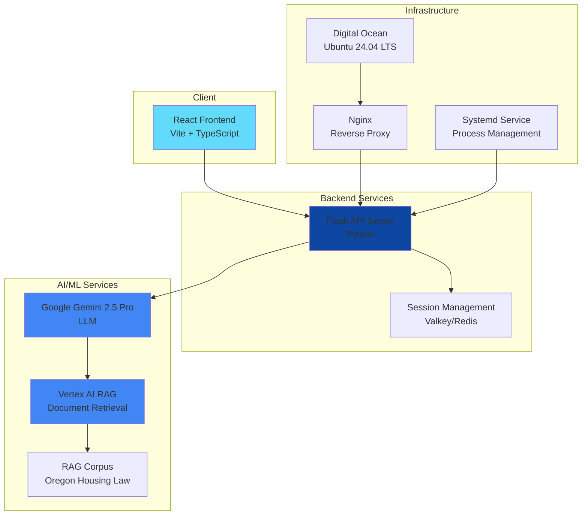
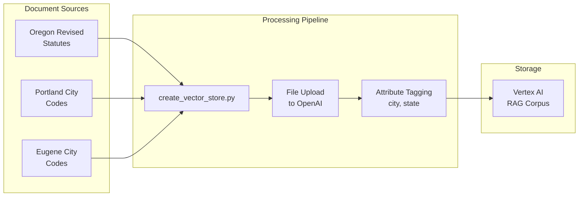
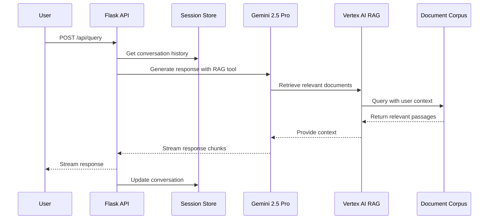
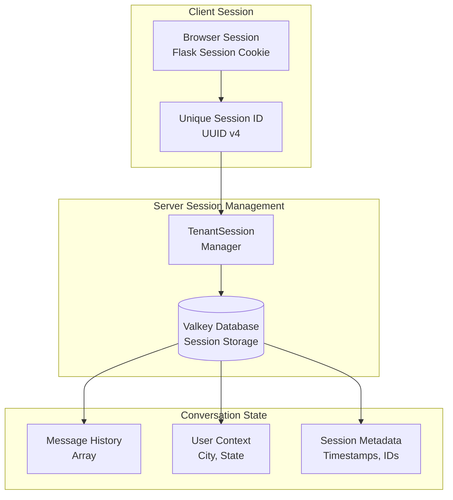
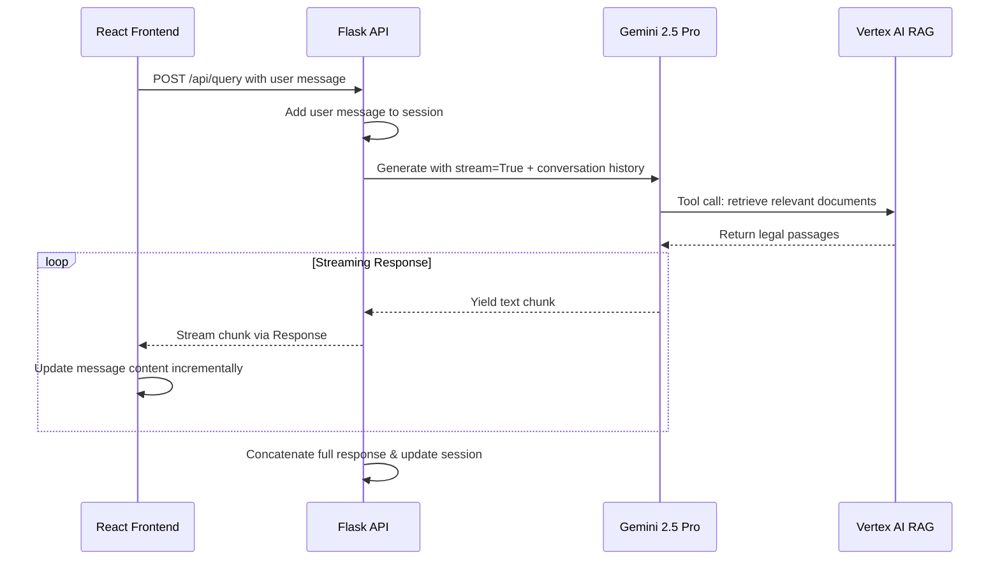
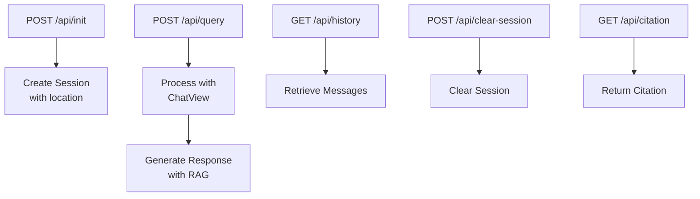
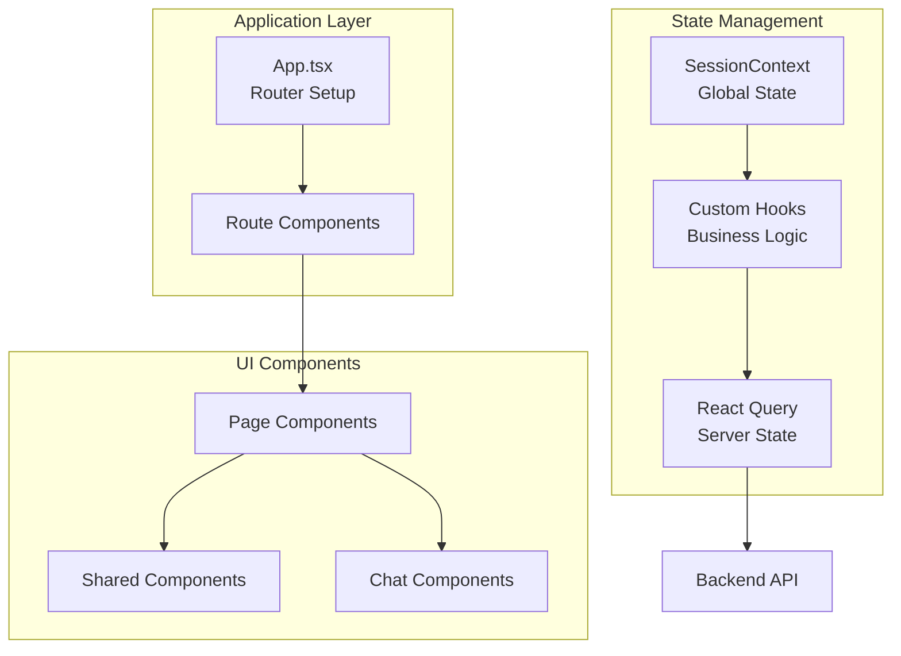
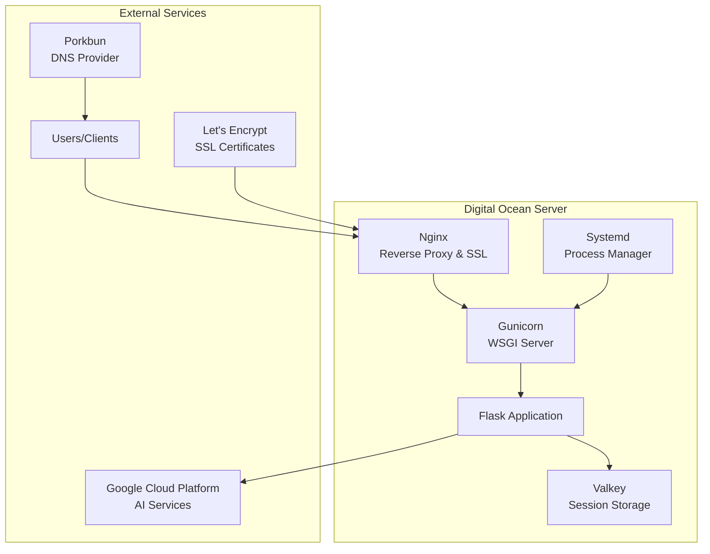
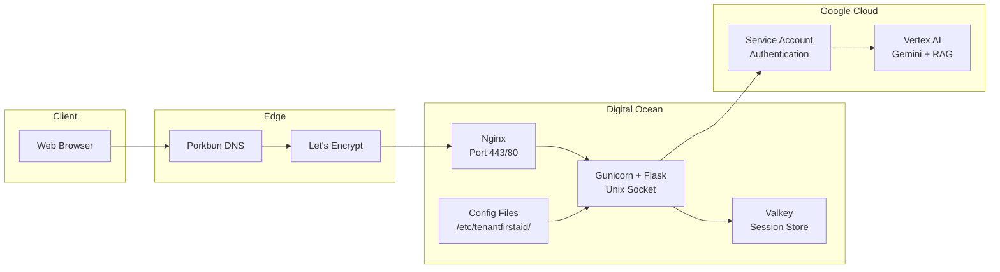

# Tenant First Aid - Architecture Documentation

## Overview

Tenant First Aid is a chatbot application that provides legal advice related to housing and eviction in Oregon. The system uses a Retrieval-Augmented Generation (RAG) architecture to provide accurate, contextual responses based on Oregon housing law documents.

The application follows a modern web architecture with a Flask-based Python backend serving a React frontend, deployed on Digital Ocean infrastructure.



## Backend

### Overview

The backend is a Flask-based Python application that serves as the API layer for the chatbot. It handles user sessions, manages conversations, and orchestrates interactions with Google's Vertex AI services for RAG-based responses.

### Directory/File Structure

```
backend/
├── tenantfirstaid/                 # Main application package
│   ├── __init__.py
│   ├── app.py                      # Flask application setup and routing
│   ├── chat.py                     # Chat logic and Gemini integration
│   ├── citations.py                # Citation handling
│   ├── session.py                  # Session management
│   ├── feedback.py                 # Message feedback logic and email integration
│   └── sections.json               # Legal section mappings
├── scripts/                        # Utility scripts
│   ├── create_vector_store.py      # RAG corpus setup
│   ├── convert_csv_to_jsonl.py     # Data conversion utilities
│   └── documents/                  # Source legal documents
│       └── or/                     # Oregon state laws
│           ├── OAR54.txt           # Oregon Administrative Rules
│           ├── ORS090.txt          # Oregon Revised Statutes
│           ├── ORS091.txt
│           ├── ORS105.txt
│           ├── ORS109.txt
│           ├── ORS659A.txt
│           ├── portland/           # Portland city codes
│           │   └── PCC30.01.txt
│           └── eugene/             # Eugene city codes
│               └── EHC8.425.txt
├── tests/                          # Test suite
├── pyproject.toml                  # Python dependencies and config
├── docker-compose.yml              # Local development setup
└── Makefile                        # Development commands
```

### RAG (Retrieval-Augmented Generation)

The system uses **Vertex AI RAG (Retrieval-Augmented Generation)**, which combines Google's Vertex AI vector search capabilities with the Gemini 2.5 Pro language model. This is specifically a **grounded generation** approach where the LLM has access to a tool-based retrieval system that searches through a curated corpus of Oregon housing law documents.

**RAG Type and Category:**

- **Architecture Type**: Tool-augmented RAG with function calling
- **Implementation**: Vertex AI managed RAG service
- **Retrieval Method**: Dense vector similarity search with semantic matching
- **Grounding**: Tool-based retrieval integrated directly into Gemini's generation process

#### Data Ingestion Pipeline

The RAG system processes legal documents to create a searchable knowledge base:



**Data Ingestion Process:**

1. **Document Collection**: Legal documents are stored as text files organized by jurisdiction:

   - State laws: `documents/or/*.txt`
   - City codes: `documents/or/portland/*.txt`, `documents/or/eugene/*.txt`

2. **Vector Store Creation**: The `create_vector_store.py` script:

   - Processes documents by directory structure
   - Adds metadata attributes (city, state) for filtering
   - Uploads files to Vertex AI RAG corpus
   - Handles UTF-8 encoding requirements

3. **Metadata Attribution**: Documents are tagged with jurisdiction metadata to enable location-specific queries

#### Query Pipeline

The query pipeline retrieves relevant legal information and generates responses:



**Query Process:**

1. **Context Preparation**: User query is combined with conversation history and location context
2. **RAG Retrieval**: Vertex AI RAG searches the document corpus for relevant legal passages
3. **Response Generation**: Gemini 2.5 Pro generates contextual responses using retrieved documents
4. **Streaming Response**: Response is streamed back to the client in real-time
5. **Session Update**: Conversation state is persisted for continuity

## Multi-Turn Conversation Management

The system maintains conversational context across multiple interactions through a sophisticated session management approach that preserves conversation history while enabling contextual responses.

### Session Architecture



### Conversation Persistence

**Session Data Structure:**

```typescript
interface TenantSessionData {
  city: string; // User's city (e.g., "portland", "eugene", "null")
  state: string; // User's state (default: "or")
  messages: Array<{
    // Complete conversation history
    role: "user" | "model";
    content: string;
  }>;
}
```

**Multi-Turn Implementation Details:**

1. **Session Initialization** (`/api/init`):

   - Creates UUID v4 session identifier
   - Initializes empty message array
   - Stores user location context (city/state)
   - Uses Flask secure session cookies

2. **Conversation Flow**:

   - Each message exchange appends to `messages` array
   - Complete conversation history sent to Gemini for context
   - Location metadata enables jurisdiction-specific legal advice
   - Session state persisted to Valkey after each interaction

3. **Context Preservation**:

   - Full message history passed to Gemini API on each request
   - System instructions include location-specific context
   - Previous legal advice references maintained across turns
   - Citation links and legal precedents remain accessible

4. **Session Management**:
   - **Storage**: Valkey (Redis-compatible) for high-performance session data
   - **Persistence**: Sessions survive server restarts
   - **Security**: HttpOnly, SameSite cookies with secure flag in production
   - **Cleanup**: Sessions can be cleared via `/api/clear-session`

## Streaming Response Implementation

The application implements real-time response streaming to provide immediate feedback as the AI generates responses, creating a natural chat experience.

### Streaming Architecture



### Backend Streaming Implementation

**Stream Generation** (`chat.py:131-157`):

```python
def generate():
    response_stream = self.chat_manager.generate_gemini_chat_response(
        current_session["messages"],
        current_session["city"],
        current_session["state"],
        stream=True,  # Enable streaming
    )

    assistant_chunks = []
    for event in response_stream:
        # Extract text chunk from Gemini response
        chunk = event.candidates[0].content.parts[0].text
        assistant_chunks.append(chunk)
        yield chunk  # Stream to client

    # Persist complete response
    assistant_msg = "".join(assistant_chunks)
    current_session["messages"].append({
        "role": "model",
        "content": assistant_msg
    })

return Response(stream_with_context(generate()), mimetype="text/plain")
```

### Frontend Streaming Implementation

**Stream Processing** (`InputField.tsx:52-71`):

```typescript
const reader = await addMessage(userMessage);
const decoder = new TextDecoder();
let fullText = "";

while (true) {
  const { done, value } = await reader.read();
  if (done) break;

  const chunk = decoder.decode(value);
  fullText += chunk;

  // Real-time UI update
  setMessages((prev) =>
    prev.map((msg) =>
      msg.messageId === botMessageId ? { ...msg, content: fullText } : msg
    )
  );
}
```

**Streaming Features:**

- **Real-time Display**: Text appears character-by-character as generated
- **Fetch Streams API**: Uses native browser `ReadableStream` via `response.body.getReader()`
- **Error Handling**: Graceful fallback to error message if streaming fails
- **UI Responsiveness**: Loading states and disabled inputs during generation
- **Session Persistence**: Complete response saved to session storage after streaming

**Performance Benefits:**

- **Reduced Perceived Latency**: Users see responses immediately as they're generated
- **Better UX**: Natural conversation flow without waiting for complete responses
- **Scalability**: Server can handle multiple concurrent streaming connections
- **Memory Efficiency**: Chunks are processed incrementally rather than buffering entire responses

### Framework

**Core Technologies:**

- **Flask 3.1.1**: Web framework for API endpoints
- **Vertex AI**: Google Cloud AI platform for LLM and RAG
- **Valkey 6.1.0**: Redis-compatible session storage
- **Gunicorn 23.0.0**: WSGI HTTP server for production

**AI/ML Stack:**

- **Google Gemini 2.5 Pro**: Large language model
- **Vertex AI RAG**: Document retrieval system
- **Google Cloud AI Platform**: Managed AI services

### Endpoints

The backend exposes the following REST API endpoints:

| Endpoint             | Method | Description                                         |
| -------------------- | ------ | --------------------------------------------------- |
| `/api/init`          | POST   | Initialize new chat session with location           |
| `/api/query`         | POST   | Send user message and get AI response               |
| `/api/history`       | GET    | Retrieve conversation history                       |
| `/api/clear-session` | POST   | Clear current session                               |
| `/api/citation`      | GET    | Retrieve specific legal citation                    |
| `/api/feedback`      | POST   | Send user feedback with transcript as PDF via email |

**API Flow:**



## Frontend

### Overview

The frontend is a modern React application built with TypeScript and Vite. It provides a clean, accessible chat interface for users to interact with the legal advice chatbot.

### Directory/File Structure

```
frontend/
├── src/
│   ├── App.tsx                     # Main application component
│   ├── Chat.tsx                    # Chat page component
│   ├── About.tsx                   # About page
│   ├── Disclaimer.tsx              # Legal disclaimer
│   ├── PrivacyPolicy.tsx           # Privacy policy
│   ├── main.tsx                    # Application entry point
│   ├── style.css                   # Global styles
│   ├── contexts/                   # React contexts
│   │   └── SessionContext.tsx      # Session state management
│   ├── hooks/                      # Custom React hooks
│   │   ├── useMessages.tsx         # Message handling logic
│   │   ├── useSession.tsx          # Session management
│   │   └── useStatutes.tsx         # Legal statute handling
│   ├── pages/Chat/                 # Chat page components
│   │   ├── components/
│   │   │   ├── CitySelectField.tsx # Location selection
│   │   │   ├── ExportMessagesButton.tsx # Chat export
│   │   │   ├── InputField.tsx      # Message input
│   │   │   ├── MessageContent.tsx  # Message display
│   │   │   ├── MessageWindow.tsx   # Chat window
│   │   │   ├── Navbar.tsx          # Navigation
│   │   │   ├── StatuteDrawer.tsx   # Legal reference drawer
│   │   │   └── SuggestedPrompts.tsx # Prompt suggestions
│   │   └── utils/
│   │       └── exportHelper.ts     # Export functionality
│   └── shared/                     # Shared components
│       └── components/
│           ├── BackLink.tsx        # Navigation component
│           ├── BeaverIcon.tsx      # Oregon-themed icon
│           └── TenatFirstAidLogo.tsx # Application logo
├── public/
│   └── favicon.svg                 # Site favicon
├── package.json                    # Dependencies and scripts
├── vite.config.ts                  # Vite configuration
├── tsconfig.json                   # TypeScript configuration
└── eslint.config.js               # ESLint configuration
```

### Framework

**Core Technologies:**

- **React 19.0.0**: Component-based UI library
- **TypeScript 5.7.2**: Type-safe JavaScript
- **Vite 6.3.1**: Fast build tool and dev server
- **Tailwind CSS 4.1.6**: Utility-first CSS framework

**State Management:**

- **React Query (@tanstack/react-query)**: Server state management
- **React Router DOM**: Client-side routing
- **React Context**: Application-wide state

**Frontend Architecture:**



## Deployment

### Infrastructure

The application is deployed on Digital Ocean infrastructure with the following setup:

**Server Specifications:**

- **Platform**: Ubuntu LTS 24.04
- **Resources**: 2 CPUs, 2GB RAM
- **Provider**: Digital Ocean

**Technology Stack:**



**Service Configuration:**

- **Web Server**: Nginx as reverse proxy with SSL termination
- **Application Server**: Gunicorn with 10 worker processes
- **Process Management**: Systemd service for automatic restart and monitoring
- **Session Storage**: Valkey (Redis-compatible) for session persistence

### Secrets Management

The application uses environment-based secrets management:

**Configuration Files:**

- **Production**: `/etc/tenantfirstaid/env` - Environment file loaded by systemd service
- **Development**: `backend/.env` - Local environment file (git-ignored)

**Required Secrets:**

- `FLASK_SECRET_KEY` - Session encryption key
- `GOOGLE_SERVICE_ACCOUNT_CREDENTIALS_FILE` - Path to GCP service account JSON
- `GEMINI_RAG_CORPUS` - Vertex AI RAG corpus identifier
- `GEMINI_RAG_CORPUS_[CITY]` - Vertex AI RAG corpus identifier for a specific location (Optional)
- `OPENAI_API_KEY` - OpenAI API key (used by data ingestion scripts)

**Security Measures:**

- Environment variables loaded at service startup
- Service account credentials stored as JSON file
- SSL/TLS encryption via Let's Encrypt certificates
- Secure session cookies with HttpOnly and SameSite attributes

**Deployment Architecture:**



This architecture provides a scalable, secure deployment suitable for serving legal advice to tenants in Oregon while maintaining high availability and performance.
