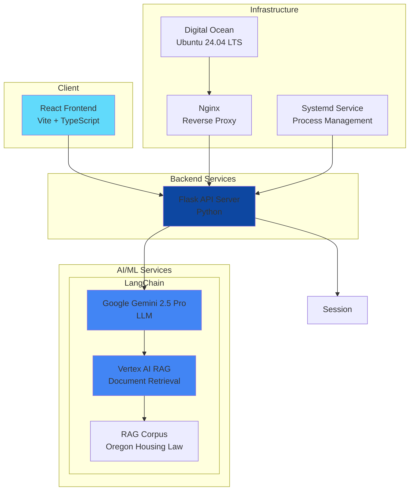
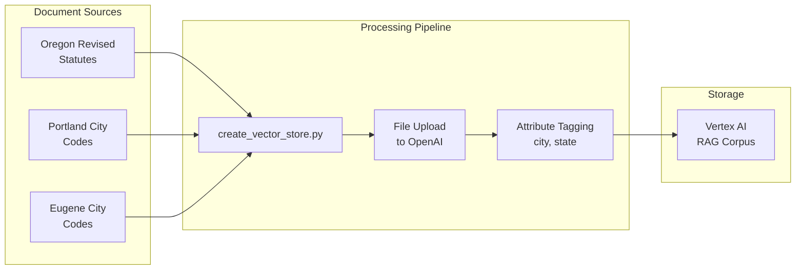
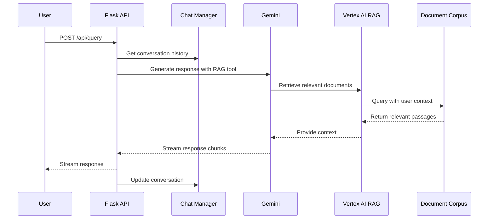
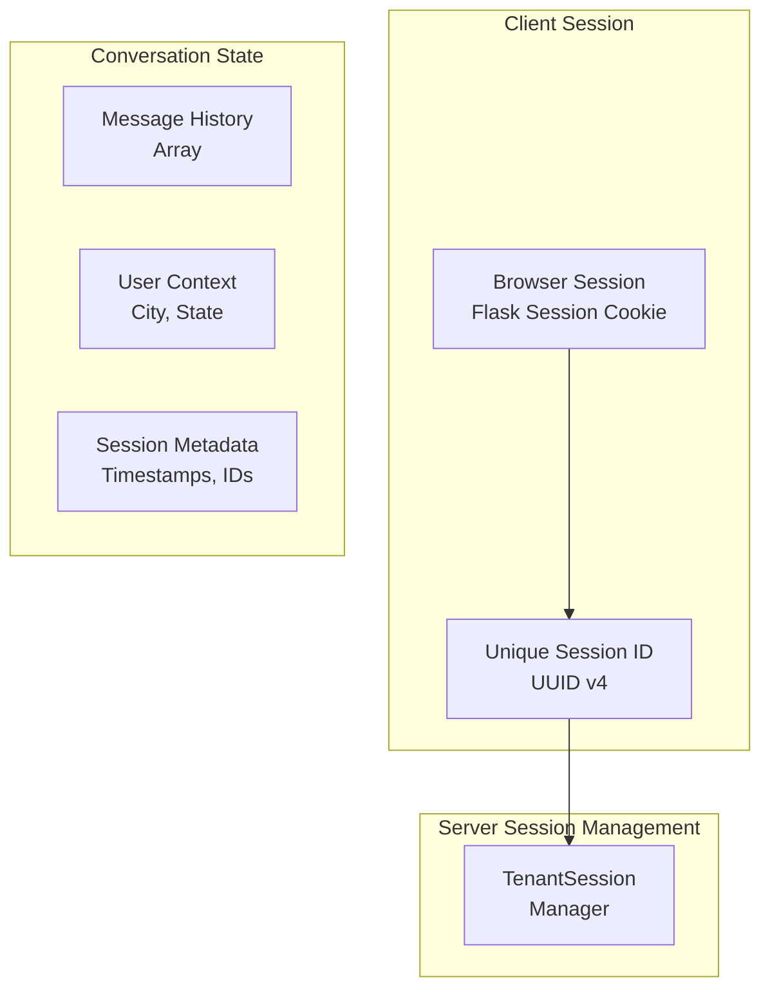
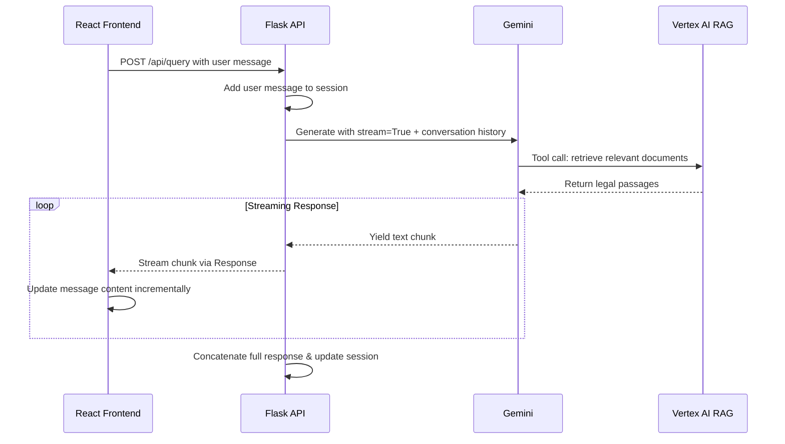
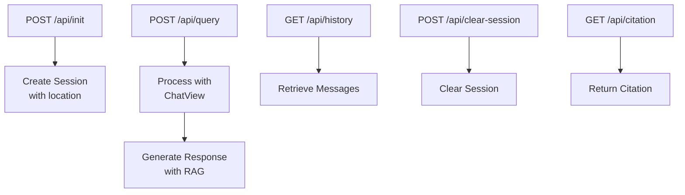
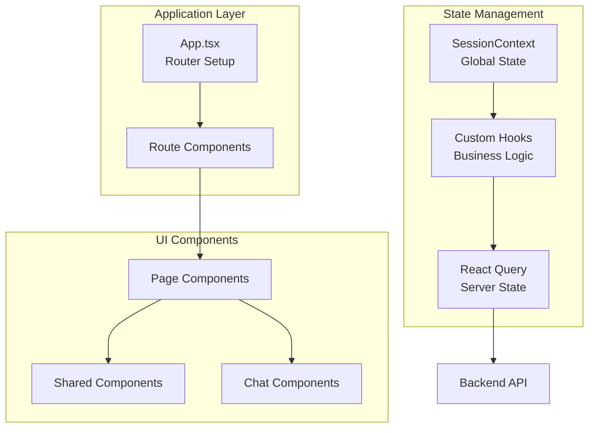

# Tenant First Aid - Architecture Documentation

## Overview

Tenant First Aid is a chatbot application that provides legal information related to housing and eviction in Oregon. The system uses a Retrieval-Augmented Generation (RAG) architecture to provide accurate, contextual responses based on Oregon housing law documents.  The LangChain framework is used to abstract models and agents.

The application follows a modern web architecture with a Flask-based Python backend serving a React frontend, deployed on Digital Ocean infrastructure.


```mermaid
graph TB
    subgraph "Client"
        Frontend[React Frontend<br/>Vite + TypeScript]
    end

    subgraph "Backend Services"
        API[Flask API Server<br/>Python]
    end

    subgraph "AI/ML Services"
        subgraph "LangChain"
            Gemini[Google Gemini 2.5 Pro<br/>LLM]
            RAG[Vertex AI RAG<br/>Document Retrieval]
            Corpus[RAG Corpus<br/>Oregon Housing Law]
        end
    end

    subgraph "Infrastructure"
        Nginx[Nginx<br/>Reverse Proxy]
        DO[Digital Ocean<br/>Ubuntu 24.04 LTS]
        Systemd[Systemd Service<br/>Process Management]
    end

    Frontend --> API
    API --> Session
    API --> Gemini
    Gemini --> RAG
    RAG --> Corpus
    Nginx --> API
    DO --> Nginx
    Systemd --> API

    style Frontend fill:#61dafb
    style API fill:#0d47a1
    style Gemini fill:#4285f4
    style RAG fill:#4285f4
```

## Backend

### Overview

The backend is a Flask-based Python application that serves as the API layer for the chatbot. It handles user sessions, manages conversations.  LangChain orchestrates interactions with Google's Gemini and Vertex AI services for RAG-based responses.

### Directory/File Structure

```
backend/
├── tenantfirstaid/                     # Main application package
│   ├── __init__.py
│   ├── app.py                          # Flask application setup and routing
│   ├── chat.py                         # Flask ChatView
|   ├── schema.py                       # Pydantic response chunk types (TextChunk, LetterChunk, ReasoningChunk)
|   ├── constants.py                    # Immutable state and consolidated interface to environment variables
|   ├── location.py                     # City & State normalization and sanitization
|   ├── langchain_chat_manager.py       # Chat model configuration and response generation
|   ├── langchain_tools.py              # LangChain Agent tools (i.e. RAG retriever)
|   ├── citations.py                    # Citation handling
│   ├── session.py                      # Session management
│   ├── feedback.py                     # Message feedback logic and email integration
│   └── sections.json                   # Legal section mappings
├── scripts/                            # Utility scripts
│   ├── create_langsmith_dataset.py     # Upload corpus to LangSmith
│   ├── langsmith_evaluators.py         # LLM-as-a-Judge configuration (i.e. scoring, rubric)
│   ├── run_langsmith_evaluators.py     # LangSmith experiment runner
│   ├── simple_langchain_demo.py        # LangChain proof-of-concept
│   ├── vertex_ai_list_datastores.py    # Utility to get Google Vertex AI Datastore IDs
│   ├── create_vector_store.py          # RAG corpus setup
│   ├── convert_csv_to_jsonl.py         # Data conversion utilities
│   ├── generate_types.py               # Models exported to the frontend; pydantic2ts generates frontend/src/types/models.ts from this (run via `make generate-types` or `npm run generate-types`)
│   └── documents/                      # Source legal documents
│       └── or/                         # Oregon state laws
│           ├── OAR54.txt               # Oregon Administrative Rules
│           ├── ORS090.txt              # Oregon Revised Statutes
│           ├── ORS091.txt
│           ├── ORS105.txt
│           ├── ORS109.txt
│           ├── ORS659A.txt
│           ├── portland/               # Portland city codes
│           │   └── PCC30.01.txt
│           └── eugene/                 # Eugene city codes
│               └── EHC8.425.txt
├── tests/                              # Test suite
├── pyproject.toml                      # Python dependencies and config
└── Makefile                            # Development commands
```

### RAG (Retrieval-Augmented Generation)

The system uses **LangChain agents** with **Vertex AI RAG** tools for document retrieval. This combines LangChain's agent orchestration with Google's Vertex AI vector search capabilities and the Gemini language model.

**Architecture Type**: Agent-based RAG with tool calling
- **Framework**: LangChain 1.1+
- **LLM Integration**: ChatGoogleGenerativeAI (langchain-google-genai 4.0+)
- **Agent Pattern**: `create_agent()` with custom RAG tools
- **Retrieval Method**: Dense vector similarity search with metadata filtering (VertexAISearchRetriever)

#### Tool-Based Retrieval

The agent has access to three tools:

1. **City-Specific and State Law Retrieval**: Searches documents filtered by city (optional) and state
2. **Letter Template**: Returns a pre-formatted letter template for the model to fill in
3. **Generate Letter**: Emits the completed letter as a custom stream chunk for the frontend to render separately from chat text

The LLM decides how to call the tool based on the user's query and location context.

#### Data Ingestion Pipeline

The RAG system processes legal documents to create a searchable knowledge base:


```mermaid
graph LR
    subgraph "Document Sources"
        ORS[Oregon Revised<br/>Statutes]
        Portland[Portland City<br/>Codes]
        Eugene[Eugene City<br/>Codes]
    end

    subgraph "Processing Pipeline"
        Script[create_vector_store.py]
        Upload[File Upload<br/>to OpenAI]
        Metadata[Attribute Tagging<br/>city, state]
    end

    subgraph "Storage"
        VectorStore[Vertex AI<br/>RAG Corpus]
    end

    ORS --> Script
    Portland --> Script
    Eugene --> Script
    Script --> Upload
    Upload --> Metadata
    Metadata --> VectorStore
```

**Data Ingestion Process:**

1. **Document Collection**: Legal documents are stored as text files organized by jurisdiction:
   - State laws: `documents/or/*.txt`
   - City codes: `documents/or/portland/*.txt`, `documents/or/eugene/*.txt`

2. **Vector Store Creation**: The `create_vector_store.py` script:
   - Processes documents by directory structure
   - Adds metadata attributes (city, state) for filtering
   - Uploads files to Vertex AI RAG corpus
   - Handles UTF-8 encoding requirements

3. **Metadata Attribution**: Documents are tagged with jurisdiction metadata to enable location-specific queries

#### Query Pipeline

The query pipeline retrieves relevant legal information and generates responses:


```mermaid
sequenceDiagram
    participant User
    participant Flask as Flask API
    participant Session as Chat Manager
    participant Gemini
    participant RAG as Vertex AI RAG
    participant Corpus as Document Corpus

    User->>Flask: POST /api/query
    Flask->>Session: Get conversation history
    Flask->>Gemini: Generate response with RAG tool
    Gemini->>RAG: Retrieve relevant documents
    RAG->>Corpus: Query with user context
    Corpus-->>RAG: Return relevant passages
    RAG-->>Gemini: Provide context
    Gemini-->>Flask: Stream response chunks
    Flask-->>User: Stream response
    Flask->>Session: Update conversation
```

**Query Process:**

1. **Context Preparation**: User query is combined with conversation history and location context
2. **RAG Retrieval**: Vertex AI RAG searches the document corpus for relevant legal passages
3. **Response Generation**: Gemini generates contextual responses using retrieved documents
4. **Streaming Response**: Response is streamed back to the client in real-time
5. **Session Update**: Conversation state is persisted for continuity

## Multi-Turn Conversation Management

The system maintains conversational context across multiple interactions by appending human and AI messages (including reasoning) to follow-up queries.

### Session Architecture

:construction: TODO: update this section

```mermaid
graph TB
    subgraph "Client Session"
        Browser[Browser Session<br/>Flask Session Cookie]
        SessionID[Unique Session ID<br/>UUID v4]
    end

    subgraph "Server Session Management"
        SessionManager[TenantSession<br/>Manager]
    end

    subgraph "Conversation State"
        Messages[Message History<br/>Array]
        Context[User Context<br/>City, State]
        Metadata[Session Metadata<br/>Timestamps, IDs]
    end

    Browser --> SessionID
    SessionID --> SessionManager
```

### Conversation Persistence

**Frontend Message Type:**

The frontend uses LangChain's `HumanMessage` and `AIMessage` classes directly to keep message types consistent with the backend:

```typescript
import type { AIMessage, HumanMessage } from "@langchain/core/messages";

type TChatMessage = HumanMessage | AIMessage;
```

LangChain's `BaseMessage` exposes several accessors for message data:
- `.content` — the raw message content (`string | Array<ContentBlock>`)
- `.text` — a getter that returns `.content` as a `string` (handles content block arrays)
- `.type` — the message role (`"human"` or `"ai"`)
- `.id` — unique message identifier

When serializing messages for the backend API, the hook maps these to the format the backend expects:

```typescript
const serializedMsg = messages.map((msg) => ({
  role: msg.type,
  content: msg.type === "ai" ? deserializeAiMessage(msg.text) : msg.text,
  id: msg.id,
}));
```

**Session Data Structure:**

```typescript
interface TenantSessionData {
  city: string; // User's city (e.g., "portland", "eugene", "null")
  state: string; // User's state (default: "or")
  messages: Array<{
    // Complete conversation history
    role: "human" | "ai";
    content: string;
  }>;
}
```

**Multi-Turn Implementation Details:**

1. **Session Initialization** (`/api/init`):
   - Creates UUID v4 session identifier :construction:
   - Initializes empty message array
   - Stores user location context (city/state)
   - Uses Flask secure session cookies :construction:

2. **Conversation Flow**:
   - Each message exchange appends to `messages` array
   - Complete conversation history sent to Gemini for context
   - Location metadata enables jurisdiction-specific legal advice

3. **Context Preservation**:
   - Full message history passed to Gemini API on each request
     - preserving Reasoning and Thought Signatures
   - System instructions include location-specific context
   - Previous legal advice references maintained across turns
   - Citation links and legal precedents remain accessible

4. **Session Management**:
   - **Persistence**: Sessions survive server restarts
   - **Security**: HttpOnly, SameSite cookies with secure flag in production
   - **Cleanup**: Sessions can be cleared via `/api/clear-session`

## Streaming Response Implementation

The application implements real-time response streaming to provide immediate feedback as the AI generates responses, creating a natural chat experience.

### Streaming Architecture


```mermaid
sequenceDiagram
    participant UI as React Frontend
    participant API as Flask API
    participant Gemini as Gemini
    participant RAG as Vertex AI RAG

    UI->>API: POST /api/query with user message
    API->>API: Add user message to session
    API->>Gemini: Generate with stream=True + conversation history
    Gemini->>RAG: Tool call: retrieve relevant documents
    RAG-->>Gemini: Return legal passages

    loop Streaming Response
        Gemini-->>API: Yield text chunk
        API-->>UI: Stream chunk via Response
        UI->>UI: Update message content incrementally
    end

    API->>API: Concatenate full response & update session
```

### Frontend Streaming Implementation

**Stream Processing** (`streamHelper.ts`):

```typescript
async function streamText({
  addMessage,
  setMessages,
  housingLocation,
  setIsLoading,
}: IStreamTextOptions): Promise<boolean | undefined> {
  const botMessageId = (Date.now() + 1).toString();

  setIsLoading?.(true);

  // Add empty bot message immediately so "Typing..." appears before the API responds.
  setMessages((prev) => [
    ...prev,
    new AIMessage({ content: "", id: botMessageId }),
  ]);

  try {
    const reader = await addMessage(housingLocation);
    if (!reader) {
      console.error("Stream reader is unavailable");
      const nullReaderError: TUiMessage = {
        type: "ui",
        text: "Sorry, I encountered an error. Please try again.",
        id: botMessageId,
      };
      setMessages((prev) =>
        prev.map((msg) => (msg.id === botMessageId ? nullReaderError : msg)),
      );
      return;
    }

    const decoder = new TextDecoder();
    let buffer = "";
    let fullText = "";

    while (true) {
      const { done, value } = await reader.read();
      if (done) {
        // Flush any remaining content in the buffer.
        if (buffer.trim() !== "") processLines([buffer]);
        return true;
      }
      buffer += decoder.decode(value, { stream: true });
      const lines = buffer.split("\n");
      buffer = lines.pop() || "";
      processLines(lines);
    }
  } catch (error) {
    console.error("Error:", error);
    const errorMessage: TUiMessage = {
      type: "ui",
      text: "Sorry, I encountered an error. Please try again.",
      id: botMessageId,
    };
    setMessages((prev) => [
      ...prev.filter((msg) => msg.id !== botMessageId),
      errorMessage,
    ]);
  } finally {
    setIsLoading?.(false);
  }
}
```

**Streaming Features:**

- **Real-time Display**: Text appears character-by-character as generated
- **Fetch Streams API**: Uses native browser `ReadableStream` via `response.body.getReader()`
- **Error Handling**: Graceful fallback to error message if streaming fails
- **UI Responsiveness**: Loading states and disabled inputs during generation
- **Session Persistence**: Complete response saved to session storage after streaming

**Performance Benefits:**

- **Reduced Perceived Latency**: Users see responses immediately as they're generated
- **Better UX**: Natural conversation flow without waiting for complete responses
- **Scalability**: Server can handle multiple concurrent streaming connections
- **Memory Efficiency**: Chunks are processed incrementally rather than buffering entire responses

### Framework

**Core Technologies:**

- **Flask 3.1.1**: Web framework for API endpoints
- **Vertex AI**: Google Cloud AI platform for LLM and RAG
- **Gunicorn 23.0.0**: WSGI HTTP server for production

**AI/ML Stack:**

- **Google Gemini 2.5 Pro**: Large language model
- **Vertex AI RAG**: Document retrieval system
- **Google Cloud AI Platform**: Managed AI services

### Endpoints

The backend exposes the following REST API endpoints:

| Endpoint             | Method | Description                                         |
| -------------------- | ------ | --------------------------------------------------- |
| `/api/init`          | POST   | Initialize new chat session with location           |
| `/api/query`         | POST   | Send user message and get AI response               |
| `/api/history`       | GET    | Retrieve conversation history                       |
| `/api/clear-session` | POST   | Clear current session                               |
| `/api/citation`      | GET    | Retrieve specific legal citation                    |
| `/api/feedback`      | POST   | Send user feedback with transcript as PDF via email |

**API Flow:**


```mermaid
graph TD
    Init[POST /api/init] --> Session[Create Session<br/>with location]
    Query[POST /api/query] --> Chat[Process with<br/>ChatView]
    Chat --> Gemini[Generate Response<br/>with RAG]
    History[GET /api/history] --> SessionGet[Retrieve Messages]
    Clear[POST /api/clear-session] --> SessionClear[Clear Session]
    Citation[GET /api/citation] --> LegalCite[Return Citation]
```

## Frontend

### Overview

The frontend is a modern React application built with TypeScript and Vite. It provides a clean, accessible chat interface for users to interact with the legal advice chatbot.

### Directory/File Structure

```
frontend/
├── src/
│   ├── App.tsx                     # Main application component with routing logic
│   ├── Chat.tsx                    # Chat page component
│   ├── Letter.tsx                  # Letter page component
│   ├── About.tsx                   # About page
│   ├── Disclaimer.tsx              # Legal disclaimer
│   ├── PrivacyPolicy.tsx           # Privacy policy
│   ├── main.tsx                    # Application entry point
│   ├── style.css                   # Global styles
│   ├── contexts/                   # React Contexts
│   │   └── HousingContext.tsx      # Housing context for chat/letter generation
│   ├── hooks/                      # Custom React hooks
│   │   ├── useIsMobile.tsx         # Checking mobile state
│   │   ├── useMessages.tsx         # Message handling logic
│   │   ├── useHousingContext.tsx   # Custom hook for housing context
│   │   └── useLetterContent.tsx    # State management for letter generation
│   ├── types/                      # Auto-generated TypeScript types (gitignored) — do not edit manually, re-run `make generate-types` or `npm run generate-types`
│   │   └── models.ts                  # All exported types: ResponseChunk, Location, OregonCity, UsaState, chunk interfaces
│   ├── layouts/                    # Layouts
│   │   └── PageLayout.tsx          # Layout for pages
│   ├── pages/
│   │   ├── Chat/                   # Chat page components
│   │   │   ├── components/
│   │   │   │   ├── ChatDisclaimer.tsx # Disclaimer for Chat page
│   │   │   │   ├── InitializationForm.tsx # Context information from user
│   │   │   │   ├── AutoExpandText.tsx  # Animated Text component
│   │   │   │   ├── ExportMessagesButton.tsx # Chat export
│   │   │   │   ├── InputField.tsx      # Message input
│   │   │   │   ├── FeedbackModal.tsx   # Feedback modal
│   │   │   │   ├── MessageContent.tsx  # Message display
│   │   │   │   ├── MessageWindow.tsx   # Chat window
│   │   │   │   └── SelectField.tsx     # Initialization form select field
│   │   │   └── utils/
│   │   │       ├── exportHelper.ts     # Export functionality
│   │   │       ├── feedbackHelper.ts   # Feedback functionality
│   │   │       ├── formHelper.ts       # Housing context functionality
│   │   │       └── streamHelper.ts     # Stream functionality
│   │   ├──Letter/               # Letter page components
│   │   │   ├── components/
│   │   │   │   ├── LetterDisclaimer.tsx # Disclaimer for Letter page
│   │   │   │   └── LetterGenerationDialog.tsx # Letter page dialog
│   │   │   └── utils/
│   │   │       └── letterHelper.ts     # Letter generation functionality
│   │   └── LoadingPage.tsx             # Loading component for routes
│   ├── shared/                     # Shared components and utils
│   │   ├── components/
│   │   │   ├── Navbar/
│   │   │   │   ├── Sidebar.tsx     # Navigation for mobile
│   │   │   │   ├── Navbar.tsx      # Navigation
│   │   │   │   └── NavbarMenuButton.tsx # Navigation component
│   │   │   ├── BackLink.tsx        # Navigation component
│   │   │   ├── BeaverIcon.tsx      # Oregon-themed icon
│   │   │   ├── DisclaimerLayout.tsx  # Layout for disclaimer components
│   │   │   ├── FeatureSnippet.tsx  # Features and references component
│   │   │   ├── MessageContainer.tsx  # Layout for main UI component
│   │   │   ├── PageSection.tsx     # Layout static page sections component
│   │   │   ├── SafeMarkdown.tsx    # Safe markdown renderer
│   │   │   └── TenantFirstAidLogo.tsx # Application logo
│   │   ├── constants/
│   │   │   └── constants.ts        # File of constants
│   │   └── utils/
│   │       ├── scrolling.ts        # Helper function for window scrolling
│   │       ├── dompurify.ts        # Helper function for sanitizing text
│   │       └── formatLocation.ts   # Formats OregonCity/UsaState into a display string (e.g. "Portland, OR")
│   └── tests/                     # Testing suite
│   │   ├── components/            # Component testing
│   │   │   ├── About.test.tsx     # About component testing
│   │   │   ├── ChatDisclaimer.test.tsx # ChatDisclaimer component testing
│   │   │   ├── HousingContext.test.tsx # HousingContext component testing
│   │   │   ├── InitializationForm.test.tsx # InitializationForm component testing
│   │   │   ├── Letter.test.tsx    # Letter component testing
│   │   │   ├── LetterDisclaimer.test.tsx # LetterDisclaimer component testing
│   │   │   ├── LoadingPage.test.tsx # LoadingPage component testing
│   │   │   ├── MessageContainer.test.tsx # MessageContainer component testing
│   │   │   ├── MessageContent.test.tsx # MessageContent component testing
│   │   │   ├── MessageWindow.test.tsx # MessageWindow component testing
│   │   │   ├── PageLayout.test.tsx # PageLayout component testing
│   │   │   └── PageSection.test.tsx # PageSection component testing
│   │   ├── hooks/                 # Hook testing
│   │   │   ├── useLetterContent.test.tsx # useLetterContent testing
│   │   │   └── useMessages.test.ts # useMessages testing
│   │   └── utils/                  # Utility function testing
│   │       ├── dompurify.test.ts   # dompurify testing
│   │       ├── exportHelper.test.ts # exportHelper testing
│   │       ├── feedbackHelper.test.ts # feedbackHelper testing
│   │       ├── formHelper.test.ts  # formHelper testing
│   │       ├── letterHelper.test.ts # letterHelper testing
│   │       ├── sanitizeText.test.ts # sanitizeText testing
│   │       ├── streamHelper.test.ts # streamHelper testing
│   │       └── formatLocation.test.ts # formatLocation testing
├── public/
│   └── favicon.svg                 # Site favicon
├── package.json                    # Dependencies and scripts
├── vite.config.ts                  # Vite configuration
├── vitest.config.ts                # Vitest configuration
├── tsconfig.json                   # TypeScript configuration
└── eslint.config.js                # ESLint configuration
```

### Framework

**Core Technologies:**

- **React 19.0.0**: Component-based UI library
- **TypeScript 5.7.2**: Type-safe JavaScript
- **Vite 6.3.1**: Fast build tool and dev server
- **Tailwind CSS 4.1.6**: Utility-first CSS framework

**State Management:**

- **React Query (@tanstack/react-query)**: Server state management
- **React Router DOM**: Client-side routing
- **React Context**: Application-wide state

**Frontend Architecture:**


```mermaid
graph TB
    subgraph "Application Layer"
        App[App.tsx<br/>Router Setup]
        Routes[Route Components]
    end

    subgraph "State Management"
        Context[SessionContext<br/>Global State]
        Hooks[Custom Hooks<br/>Business Logic]
        ReactQuery[React Query<br/>Server State]
    end

    subgraph "UI Components"
        Pages[Page Components]
        Shared[Shared Components]
        ChatComponents[Chat Components]
    end

    App --> Routes
    Routes --> Pages
    Pages --> ChatComponents
    Pages --> Shared
    Context --> Hooks
    Hooks --> ReactQuery
    ReactQuery --> API[Backend API]
```

## Deployment

For full deployment documentation — environments, CI/CD pipeline, secrets management, debugging, permissions, and observability — see [Deployment.md](Deployment.md).
